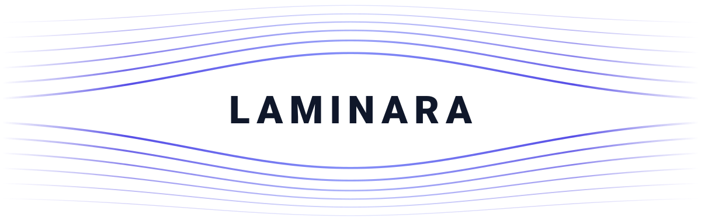
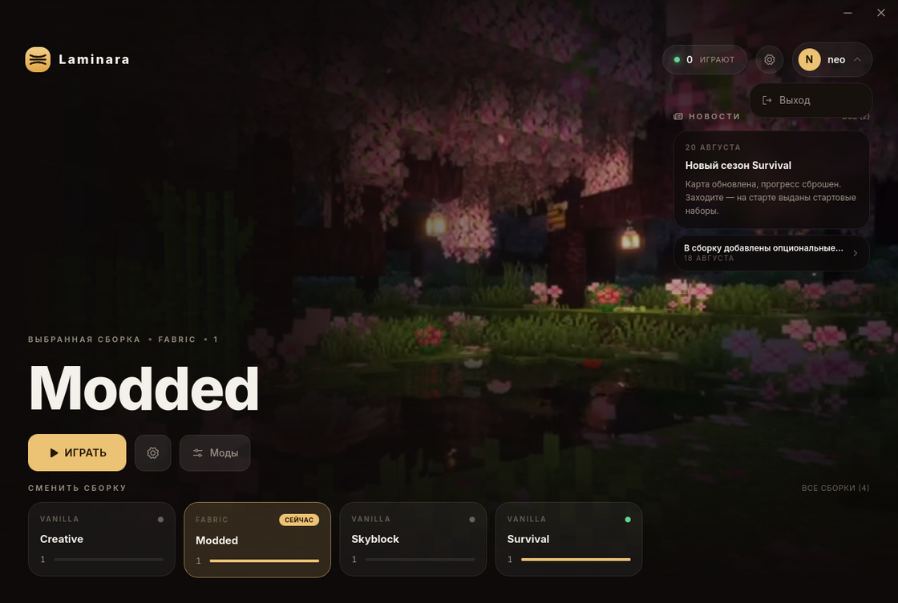

<p align="center">
  <picture>
    <source media="(prefers-color-scheme: dark)" srcset="docs/logo/banner-dark.svg">
    
  </picture>
</p>

Laminara — лаунчер Minecraft и сервер, который готовит для него сборки.

Сервер собирает клиент нужной версии с нужным загрузчиком, подписывает его и раздаёт. Лаунчер
у игрока сверяет подпись, докачивает то, что изменилось, и запускает игру. Аккаунты берутся из
вашей базы: своей таблицы аккаунтов у Laminara нет, и чужие пароли она не хранит.

<p align="center">
  
</p>

## Что умеет

Сборки — vanilla, Fabric, Quilt, Forge, NeoForge, любая версия Minecraft. Сервер сам качает
Minecraft и Java и сам же прогоняет установщик загрузчика: игроку собирать нечего.

Каждый манифест подписан ключом Ed25519, и лаунчер верит файлам по подписи, а не по тому,
откуда они приехали, — раздавать байты можно хоть с чужого зеркала. Ключей в кольце может быть
несколько, поэтому ключ можно сменить, не выбрасывая уже разошедшиеся лаунчеры.

У игрока файлы лежат на диске по содержимому и раскладываются по сборкам жёсткими ссылками: десять
сборок на одной версии делят одну копию Java и библиотек, а повторная синхронизация почти
ничего не стоит.

Вход в игре — свой Yggdrasil для authlib-injector. Скины берутся из шаблона, вашего API или
прямо из колонок вашей базы.

Лаунчер узнаёт компьютер игрока, так что банить можно аккаунт, саму машину или группу
связанных машин. Отчёт о машине подписан ключом из TPM, если он на компьютере есть.

Опциональные моды, доступ к сборкам по спискам, новости, автообновление лаунчера. Сам лаунчер
собирается под Windows, macOS и Linux.

Почти везде, где вариантов больше одного, стоит адаптер с блоком в конфиге: аккаунты,
хранилище, скины, доступ, машины, новости, загрузчики. Чтобы подключить своё, форк не нужен.

## Чем отличается от GravitLauncher

GravitLauncher — самый известный лаунчер в русскоязычном Minecraft. Таблица собрана по коду
версии 5.7.12, последний коммит — май 2026.

| | Laminara | GravitLauncher |
| --- | --- | --- |
| Стек | Go на сервере, Rust и Tauri в лаунчере | Java и на сервере, и в лаунчере |
| Что скачивает игрок | один нативный файл, ставить ничего не надо | по умолчанию `.jar`; нативный `.exe` собирает модуль Prestarter, он же докачивает Java на компьютер игрока |
| Подготовка сборки | `install` сам качает Minecraft и Java и прогоняет установщик Forge или NeoForge без графики | модуль MirrorHelper: нужен ключ CurseForge, установщики Forge и Fabric кладутся в папку руками, а для Forge нужна графика |
| Доверие к файлам | манифест подписан Ed25519, в кольце может быть несколько ключей — раздавать байты можно с любого зеркала | список файлов приходит от LaunchServer, файлы сверяются по SHA-1; доверие держится на соединении с сервером |
| Место на диске у игрока | общий склад по содержимому и жёсткие ссылки: сборки на одной версии делят Java и библиотеки | свой каталог на каждый профиль |
| Отпечаток компьютера | солёные хеши по каждому сигналу, серийники до сервера не доезжают; отчёт подписан ключом из TPM | серийник диска, плата, видеокарта и экран уходят на сервер как есть |
| Хранилище файлов на сервере | файловая система или S3 | каталог `updates` на сервере |
| Новости в лаунчере | есть, часть контракта: из файла или вашего API | в основном репозитории нет |
| Лицензия | AGPL-3.0 | GPL-3.0 |

## Быстрый старт

Сервер (только Linux):

```sh
curl -fsSL https://raw.githubusercontent.com/MrLeonardosMi/Laminara/main/install.sh | bash
laminara-server status
```

Установщик расспросит про хранилище, аккаунты и домен и соберёт конфиг сам. Дальше —
[быстрый старт](docs/quickstart.mdx): подготовить сборку и опубликовать её.

Лаунчер собирается под конкретный проект: адрес сервера, ключи и оформление запекаются
в файл.

```sh
laminara-server client-config --config /etc/laminara/config.json \
  --endpoint https://launcher.example.com > mygame.client.json

cd client
./build-launcher.sh ../mygame.client.json --target windows
./build-launcher.sh ../mygame.client.json --target linux
```

Лаунчер под Windows собирается кросс-компиляцией с Linux — виртуальная машина не нужна.
Подробности и требования: [сборка лаунчера](docs/launcher/building.mdx).

## Из чего состоит

Подробности — в [документации](docs/), общая картина — на странице
[«Как устроено»](docs/architecture.mdx).

| Каталог | Что внутри |
| --- | --- |
| `proto/` | Контракты, по которым работают сервер и лаунчер. |
| `server/` | Сервер на Go: демон, сборки, хранилище, аккаунты, Yggdrasil, модули. |
| `client/core/` | Ядро лаунчера на Rust: транспорт, синхронизация, запуск, обновление. |
| `client/src-tauri/` | Оболочка Tauri: команды, хранилище секретов ОС. |
| `client/src/` | Интерфейс: React 19, Vite, Tailwind. |
| `sdk/go/module` | SDK для внешних модулей сервера (go-plugin). |
| `deploy/` | Dockerfile, compose, systemd, nginx, пример конфига. |

## Разработка

Нужны Go 1.26+, Rust 1.96+, Node 24 + pnpm и [buf](https://buf.build) 1.71+.

```sh
make generate   # protobuf → gen/go, нужно перед сборкой
make build
make test
make lint       # buf lint + go vet
```

Лаунчер:

```sh
cd client
pnpm install
pnpm dev                                  # интерфейс в браузере, без Tauri
pnpm tsc --noEmit -p tsconfig.json
cargo test -p laminara-launcher-core
```

Сборка exe под Windows дополнительно требует `cargo install cargo-xwin` и пакеты
`clang lld llvm`.

Документация — сайт на Astro Starlight, страницы лежат в `docs/`:

```sh
cd site
pnpm install
pnpm dev      # локальный просмотр
pnpm build    # статика в site/dist
```

## Лицензия

[GNU AGPL-3.0](LICENSE). Пользоваться, менять и запускать у себя можно свободно. Если вы
дорабатываете Laminara и даёте к ней доступ по сети — например, держите на ней лаунчер
чужого проекта, — правки нужно открыть. Продавать внедрение и поддержку это не запрещает.

© 2026 MrLeonardos
