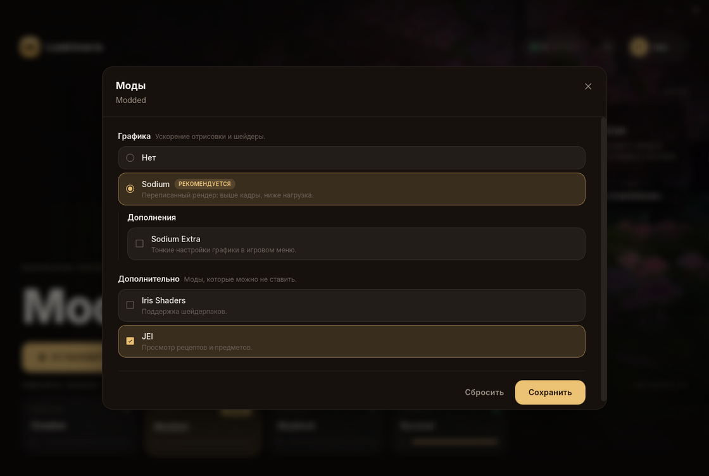

Оператор может дать игроку выбор опциональных модов в лаунчере — на стороне каждой
сборки. Всё описывается в `laminara.settings.json` профиля, рядом с политиками файлов,
и штампуется в подписанный манифест при `publish`.

## Как это работает

Манифест несёт ВСЕ файлы (базовые и опциональные), каждый подписан и лежит в CAS.
Файл считается **опциональным**, если он указан в `files` какой-либо опции; иначе он
**базовый** и ставится всегда. Игрок выбирает опции в лаунчере — клиент ставит базу
плюс выбранное и удаляет снятое. Подделать выбор нельзя: можно выбрать лишь
подмножество уже подписанных файлов.



## Авторинг

Положите все моды (базовые и опциональные) в `mods/` профиля и опишите блок `features`:

```json
{
  "loader": "neoforge",
  "userWritable": ["config/", "options.txt"],
  "features": {
    "groups": [
      {
        "id": "graphics",
        "title": "Графика",
        "selection": "single",
        "options": [
          {
            "id": "sodium",
            "title": "Sodium",
            "defaultEnabled": true,
            "files": ["mods/sodium.jar"],
            "meta": { "badge": "Рекомендуется" },
            "groups": [
              {
                "id": "extras",
                "title": "Дополнения Sodium",
                "selection": "multi",
                "options": [
                  { "id": "extra", "title": "Sodium Extra", "files": ["mods/sodium-extra.jar"] }
                ]
              }
            ]
          },
          { "id": "embeddium", "title": "Embeddium", "files": ["mods/embeddium.jar", "mods/oculus.jar"] }
        ]
      },
      {
        "id": "utility",
        "title": "Утилиты",
        "selection": "multi",
        "options": [
          { "id": "jei", "title": "JEI", "defaultEnabled": true, "files": ["mods/jei.jar"] }
        ]
      }
    ]
  }
}
```

- `selection`: `single` — ровно один выбор (радио); `multi` — любое число (чекбоксы).
- `required: true` в single-группе — выбор нельзя обнулить (всегда активна одна опция).
- `defaultEnabled` — опция включена по умолчанию (в single-группе не больше одной).
- `files` — массив путей относительно профиля; можно несколько на опцию.
- `groups` внутри опции — вложенный подвыбор, видимый только пока опция активна.
- `meta.badge` / `meta.icon` — украшения строки в лаунчере; размер опции считается сам.

## Аргументы запуска

Некоторым модам мало своих файлов: агенту нужен `-javaagent`, патчеру — своя строка
в classpath, режиму — аргумент клиента. Опция описывает это тремя полями:

```json
{
  "id": "anticheat",
  "title": "Античит",
  "defaultEnabled": true,
  "files": ["mods/guard.jar"],
  "jvmArgs": ["-javaagent:${library_directory}/guard/agent.jar", "-Dguard.strict=true"],
  "classpath": ["libraries/guard/agent.jar"],
  "gameArgs": ["--guard"]
}
```

- `jvmArgs` — аргументы Java, встают после аргументов профиля и до главного класса.
- `gameArgs` — аргументы клиента, встают последними.
- `classpath` — пути относительно папки профиля; разделитель (`:` или `;`) лаунчер
  подставляет сам по платформе сборки, писать его руками не нужно.
- В `jvmArgs` и `gameArgs` работают те же подстановки, что и в профиле:
  `${library_directory}`, `${classpath_separator}`, `${version_name}`.

Аргументы едут внутри подписанного манифеста, а не в файле рядом с игрой, поэтому подменить
их у зеркала раздачи не выйдет: лаунчер сверяет подпись до того, как читает опции. Выключенная
опция ничего не добавляет — как и опция, снятая ограничением `requires` или `incompatibleWith`.
Порядок аргументов задан порядком опций в файле настроек, поэтому один и тот же выбор всегда
даёт одну и ту же команду.

С загрузчиками `forge` и `neoforge` проверяйте добавку на живом запуске: игру там поднимает
BootstrapLauncher со своим списком модулей, и лишняя строка в `classpath` может быть им
проигнорирована.

## Правила

Публикация отклонит сборку, если:

- id не уникальны среди соседей или `selection` не задан;
- файла опции или записи `classpath` нет в сборке;
- в single-группе больше одного дефолта;
- опциональный файл попадает под `userWritable` — снятый user-writable нельзя было бы удалить,
  поэтому опциональные моды должны быть неизменяемыми;
- опция переопределяет то, что лаунчер выставляет сам: classpath, путь к нативам, аргументы
  сессии игрока и метки лаунчера и authlib-injector. Точное имя аргумента, из-за которого
  публикация отказала, называет текст ошибки;
- запись `jvmArgs` не начинается с дефиса — Java приняла бы её за главный класс, и сборка не
  запустилась бы ни разу;
- путь в `classpath` абсолютный, уходит из папки профиля через `..` или содержит разделитель.

Общие зависимости базовых модов не указывайте ни в одной опции — иначе они станут условными;
оставьте их вне `features`, и они будут базовыми.
