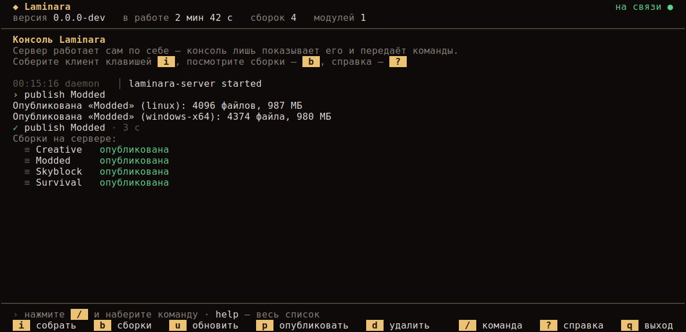
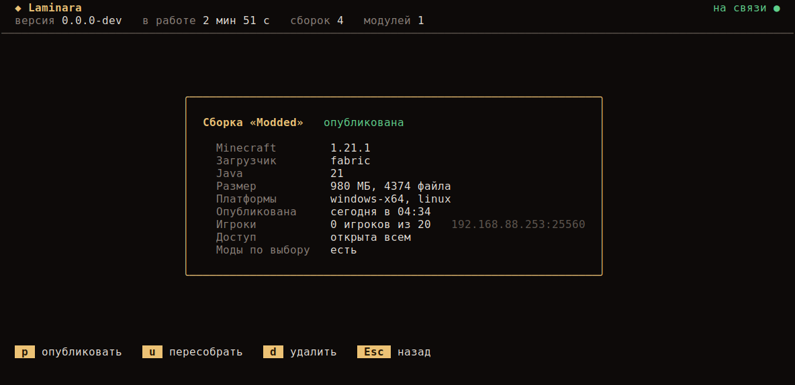
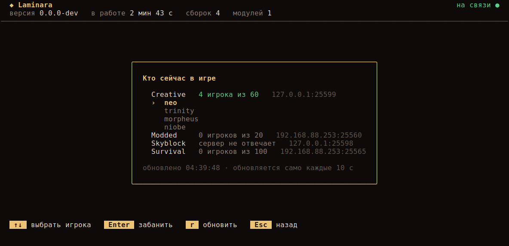
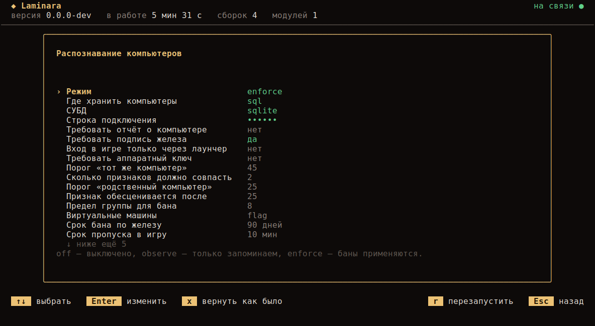

import { Aside, Steps } from "@astrojs/starlight/components";

Консоль — полноэкранный интерфейс к запущенному проекту. Сверху текут логи, снизу — панель действий, а сборки и публикация идут через мастера с поиском, так что помнить синтаксис команд не нужно.

```sh
laminara-server console
```

Если в терминале установлен Nerd Font, добавьте `--nerd` — иконки станут глифами шрифта; по умолчанию используются обычные символы, которые рисуются везде.



```
 ◆ Laminara                                                        на связи ●
 версия 1.1.0   в работе 2 мин 42 с   сборок 4   модулей 1
──────────────────────────────────────────────────────────────────────────────
 00:15:16 daemon   │ laminara-server started
 › publish Modded
 Опубликована «Modded» (linux): 4096 файлов, 987 МБ
 ✓ publish Modded · 3 с
 ⠹ Индексация файлов  1234 файла   1 с
──────────────────────────────────────────────────────────────────────────────
 › нажмите / и наберите команду · help — весь список
 i собрать   b сборки   l игроки   s настройки   u обновить   p опубликовать   ? справка
```

## Действия

| Клавиша | Действие |
| --- | --- |
| **i** | Собрать клиент — мастер спросит версию, загрузчик и имя |
| **b** | Карточка сборки — всё о ней на одном экране |
| **l** | Кто сейчас в игре — список игроков по сборкам |
| **s** | Настройки проекта — правятся прямо в консоли |
| **u** | Пересобрать существующую сборку |
| **p** | Опубликовать сборку — выбрать из списка |
| **d** | Удалить сборку (спросит подтверждение) |
| **/** | Ввести команду вручную |
| **?** | Справка по клавишам и командам |
| **q** | Выйти из консоли — проект продолжит работать |

В строке команды `Tab` дополняет имя команды, `↑` и `↓` повторяют прошлые. Верхняя строка
всё время показывает версию проекта, время работы, число сборок и модулей; если связь с
ним пропадёт, там появится «нет связи».

## Карточка сборки

`b` открывает список сборок, а по Enter — карточку: версия Minecraft и загрузчик, Java, размер
и число файлов, платформы, когда опубликована, адрес сервера с текущим онлайном, доступ и есть ли
моды по выбору. Оттуда же — действия над этой сборкой: `p` опубликовать, `u` пересобрать,
`d` удалить.



## Кто в игре

`l` показывает игроков по сборкам. Laminara опрашивает сервер каждой сборки его же протоколом
статуса — тем, которым игра рисует список серверов, — и берёт оттуда онлайн, вместимость и имена.
Экран обновляется сам каждые 10 секунд, `r` обновляет сразу.



Игрок выбирается стрелками, `Enter` предлагает его забанить — команду набирать не нужно.
Имена приходят из выборки, которую отдаёт сервер: обычно это до 12 ников, и часть серверов
её отключает — тогда видно только счётчик. Адрес берётся из `serverAddress` в
`laminara.settings.json` сборки; без него опрашивать нечего, и в списке так и написано.

## Настройки

`s` открывает настройки проекта — те же, что лежат в `config.json`, но с человеческими
подписями и подсказками. Разделы, поля и списки строятся из одной схемы, поэтому появившаяся
в сервере настройка сразу видна и в консоли.



Правка идёт прямо в строке: `Enter` на поле открывает ввод на месте, у списков вариантов
раскрывается выбор, переключатели меняются сразу. Список при этом не сдвигается — соседние
настройки остаются перед глазами. `x` возвращает полю значение по умолчанию: заданные значения
подсвечены, значения по умолчанию — приглушены.

Списки (допущенные игроки, правила доступа, настройки модулей) редактируются там же: `Enter`
на записи открывает её поля, `+ добавить` заводит новую, `x` удаляет.

Изменение сразу записывается в файл настроек, но работать начинает после перезапуска —
`r` перезапускает проект на месте: сервер поднимается заново с новыми настройками, консоль
подключается сама. Файл настроек должен быть серверу доступен на запись: в Docker это
монтирование без `:ro`. То же самое из скриптов:

```sh
laminara-server exec "settings"                      # разделы
laminara-server exec "settings hwid"                 # настройки раздела
laminara-server exec "settings hwid.mode enforce"    # изменить
laminara-server exec "settings clear hwid.minScore"  # вернуть как было
laminara-server exec "restart"
```

## Мастер сборки

Порядок аргументов помнить не нужно — мастер спрашивает всё по шагам, а в каждом списке работает поиск: просто начните печатать, чтобы отфильтровать.

<Steps>

1. **Версия Minecraft**

   Список всех версий с фильтром. Печатайте `1.21`, чтобы сузить.

2. **Загрузчик**

   Только те, что доступны для выбранной версии, плюс vanilla. Для vanilla шаг версии загрузчика пропускается.

3. **Версия загрузчика**

   Сверху — последняя. ↑↓ и Enter, или отфильтруйте поиском.

4. **Имя сборки**

   Под этим именем сборка ляжет в каталог профилей и опубликуется.

</Steps>

`↑↓` — выбор, `Enter` — дальше, `Esc` — назад или отмена.

## Живой прогресс

Долгие действия показывают фазу, полосу, счётчик и время — видно, что происходит и сколько осталось.

- **Сборка**: метаданные, затем клиент и библиотеки, ресурсы, Java, патч клиента (для Forge и NeoForge — по процессорам).
- **Публикация**: индексация файлов (хеширование), затем подпись манифеста.

## Та же консоль в браузере

Сервер отдаёт её же по адресу `/console/` — со всеми экранами, стрелками и редактированием настроек. Это удобно там, где терминала под рукой нет: панель вроде Pterodactyl умеет отправлять серверу только целые строки, поэтому её встроенная консоль команды принимает, а экранами управлять не даёт.

Ссылку выдаёт команда `web`:

```
$ laminara-server exec "web"
Ссылка действует 10 мин и открывается один раз:
https://launcher.example.com/console/enter?t=…
```

Ссылка нужна только чтобы войти: дальше браузер помнит вход неделю (`console.sessionTTL`, `0` — не забывать никогда). Пока сеанса нет, все адреса консоли отвечают «страницы нет» — снаружи не видно даже того, что она включена.

```json
{
  "console": {
    "publicUrl": "https://launcher.example.com",
    "auth": "link",
    "sessionTTL": "168h",
    "statePath": "/var/lib/laminara/console-sessions.json"
  }
}
```

`auth` выбирает вход: `link` — только по ссылке из команды, `password` — по паролю (`console.password`, хеш из `laminara-server hash`), `both` — и так, и так. Сеансы лежат в `statePath` и переживают перезапуск, а `web status` показывает, сколько их открыто; `web forget` закрывает все разом.

Внутри — тот же процесс `laminara-server console`, а не оболочка: через браузер нельзя выполнить ничего, чего нельзя в самой консоли. Выдача ссылок, входы с адресом и неудачные попытки пишутся в журнал.

<Aside type="caution">
Консоль включена с первого запуска и живёт на публичном порту, поэтому единственное, что отделяет её от интернета, — ссылка или пароль. По HTTP без сертификата и то и другое видно любому, кто слушает сеть по дороге: сервер честно пишет об этом и в журнал, и в самой консоли. Ставьте домен с TLS, ограничивайте доступ на прокси или выключайте консоль совсем — `console.enabled: false`.
</Aside>

## То же самое в скриптах

Всё, что делает консоль, доступно и как обычные команды — через `exec` они скриптуются, а код возврата пробрасывается:

```sh
laminara-server exec install survival 1.21.1 loader=neoforge
laminara-server exec publish survival
```

Полный список — в [справочнике команд](/reference/cli).
