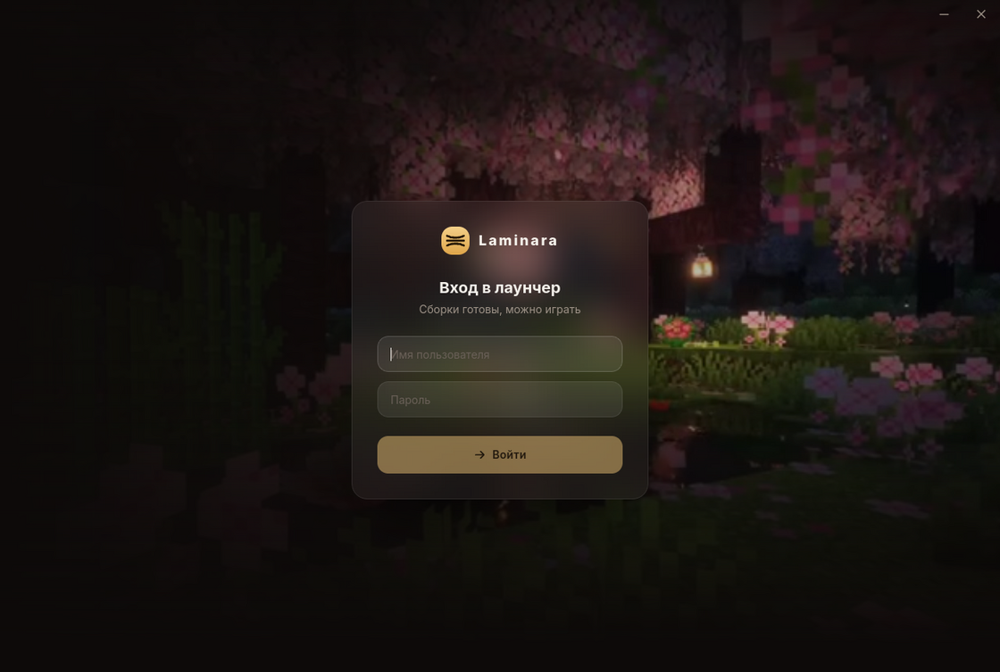

import { Steps, TabItem, Tabs } from "@astrojs/starlight/components";

Лаунчер — десктопное приложение (Windows, macOS, Linux). Игрок входит своим аккаунтом, выбирает сборку и играет; всё остальное — проверка, докачивание и запуск — лаунчер берёт на себя.

Лаунчер собирается под ваш проект: адрес сервера, ключи и оформление запекаются в файл — см. [сборку лаунчера](/launcher/building).



## Вход и токены

Вход идёт через тот же адаптер, что и на сервере. Секреты не лежат в открытом виде:

- **refresh-токен** — в защищённом хранилище ОС (Windows Credential Manager, macOS Keychain, Linux Secret Service);
- **access-токен и игровая сессия** — только в памяти процесса, во фронтенд не попадают.

При следующем запуске лаунчер молча продлевает сессию из хранилища — повторно вводить пароль не нужно.

## Синхронизация с дедупликацией

Лаунчер держит один общий контент-адресуемый склад объектов и раскладывает из него файлы по сборкам. Отсюда главная экономия: **общая база качается один раз на все сборки**.

<Steps>

1. **Проверка подписи**

   Манифест сборки проверяется по [кольцу ключей](/server/signing) Ed25519, запечённому в лаунчер. Не сошлось ни с одним — сборка отвергается целиком.

2. **Раскладка из склада**

   Неизменяемые файлы (моды, библиотеки, Java) — жёсткие ссылки на общий объект: занимают место один раз и остаются только для чтения. Десять сборок на одной версии Minecraft делят одну копию Java.

3. **Докачивание недостающего**

   Чего нет на складе — качается по `/objects/<хеш>` и проверяется по хешу. Уже установленные сборки отдают свои объекты новым мгновенно, без повторной загрузки.

</Steps>

Повторная синхронизация почти бесплатна: совпадение по идентичности файла проверяется за один системный вызов, без перечитывания содержимого.

Что можно менять, а что под замком — задаётся в [настройках сборки](/builds/settings). Файлы, которые игрок правит (конфиги, сейвы), лаунчер держит приватной копией на каждую сборку, поэтому разные настройки на разных сборках не мешают друг другу.

## Запуск

Лаунчер собирает команду запуска сам: подкладывает поставляемую с профилем Java нужной версии, подключает `authlib-injector` для входа через ваш Yggdrasil и передаёт аргументы загрузчика (Forge/NeoForge/Fabric). Игроку достаточно нажать «Играть».

## Онлайн игроков

Если у сборки задан [`serverAddress`](/builds/settings), лаунчер пингует игровой сервер и показывает живой онлайн — по сборке и суммарно по проекту.

## Логи

Лаунчер пишет свой лог в файл — пригодится, если игрок жалуется на ошибку:

<Tabs>
<TabItem label="Windows">

```text
%APPDATA%\laminara\logs\launcher.log
```

</TabItem>
<TabItem label="macOS">

```text
~/Library/Application Support/laminara/logs/launcher.log
```

</TabItem>
<TabItem label="Linux">

```text
~/.local/share/laminara/logs/launcher.log
```

</TabItem>
</Tabs>

Уровень детализации регулируется переменной `LAMINARA_LOG` (например, `debug`).
