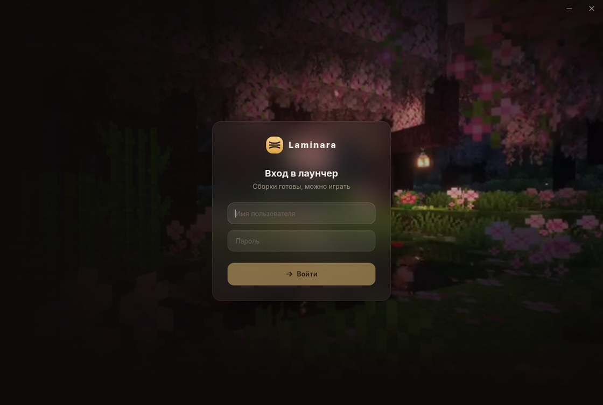

import { Steps, TabItem, Tabs } from "@astrojs/starlight/components";

Лаунчер — десктопное приложение (Windows, macOS, Linux). Игрок входит своим аккаунтом, выбирает сборку и играет; всё остальное — проверка, докачивание и запуск — лаунчер берёт на себя.

Лаунчер собирается под ваш проект: адрес сервера, ключи и оформление записываются в файл при сборке — см. [сборку лаунчера](/launcher/building).



## Вход и токены

Вход идёт через тот же адаптер, что и на сервере. Секреты не лежат в открытом виде:

- **refresh-токен** — в защищённом хранилище ОС (Windows Credential Manager, macOS Keychain, Linux Secret Service);
- **access-токен и игровая сессия** — только в памяти процесса, во фронтенд не попадают.

При следующем запуске лаунчер молча продлевает сессию из хранилища — повторно вводить пароль не нужно.

## Синхронизация с дедупликацией

Лаунчер держит один общий кеш объектов с адресацией по содержимому и раскладывает из него файлы по сборкам. Отсюда главная экономия: **общая база качается один раз на все сборки**.

<Steps>

1. **Проверка подписи**

   Манифест сборки проверяется по [набору ключей](/server/signing) Ed25519, записанному в лаунчер при сборке. Не сошлось ни с одним — сборка отвергается целиком.

2. **Раскладка из кеша**

   Неизменяемые файлы (моды, библиотеки, Java) — жёсткие ссылки на общий объект: занимают место один раз и остаются только для чтения. Десять сборок на одной версии Minecraft делят одну копию Java.

3. **Докачивание недостающего**

   Чего нет в кеше — качается по `/objects/<хеш>` и проверяется по хешу. Уже установленные сборки отдают свои объекты новым мгновенно, без повторной загрузки.

</Steps>

Повторная синхронизация почти бесплатна: совпадение по идентичности файла проверяется за один системный вызов, без перечитывания содержимого.

Что можно менять, а что под замком — задаётся в [настройках сборки](/builds/settings). Файлы, которые игрок правит (конфиги, сейвы), лаунчер держит приватной копией на каждую сборку, поэтому разные настройки на разных сборках не мешают друг другу.

## Плохая связь

Оборванный файл лаунчер докачивает с места обрыва, а не с начала: недокачанный кусок лежит рядом с общим кешем и переживает и отмену, и перезапуск лаунчера. Каждый файл получает шесть попыток с паузой от секунды до пятнадцати. Если файл так и не скачался, загрузка останавливается целиком, и игрок видит кнопку «Повторить»: всё скачанное к этому моменту остаётся на диске.

Ответы, которые повтор не исправит (файла нет на сервере, доступ к сборке закрыт), останавливают загрузку сразу. Файл, который дважды пришёл целиком и оба раза не сошёлся с хешем, испорчен на сервере: лаунчер перестаёт его качать и пишет об этом в журнал. В журнал лаунчера попадает настоящая причина каждого сбоя: таймаут, сброс соединения, ошибка TLS, код ошибки системы.

Лаунчер ходит в сеть через системный прокси, если тот задан адресом (скрипты автонастройки PAC он не читает), и доверяет сертификатам из хранилища системы. Поэтому антивирус, который проверяет HTTPS (Касперский, ESET, Avast), и корпоративная сеть его не блокируют. Подменить файлы сборки при этом нельзя: манифест подписан, а каждый файл сверяется по хешу.

Докачку поддерживают все способы раздачи: `nginx` с `X-Accel`, ссылки S3 и раздача файлов самим сервером.

## Запуск

Лаунчер собирает команду запуска сам: подкладывает поставляемую с профилем Java нужной версии, подключает `authlib-injector` для входа через ваш Yggdrasil и передаёт аргументы загрузчика (Forge/NeoForge/Fabric). Игроку достаточно нажать «Играть».

## Память для игры

Сколько оперативной памяти отдать игре, игрок задаёт для каждой сборки отдельно. Верхняя граница
ползунка — 80% памяти его компьютера: на 8 ГБ это 6 ГБ, на 32 ГБ — 25. Так игрок не сможет отдать
Minecraft всё, что есть, и получить падение при запуске. Граница считается на самом компьютере
игрока, а не берётся из настроек сервера, и лаунчер отклоняет большее значение, даже если его
попытаться выставить в обход интерфейса.

## Онлайн игроков

Если у сборки задан [`serverAddress`](/builds/settings), лаунчер пингует игровой сервер и показывает живой онлайн — по сборке и суммарно по проекту.

## Логи

Журнал самой игры в реальном времени показывает [консоль игры](/launcher/game-console).

Свой журнал лаунчер пишет в файл `launcher.log`. Игроку не нужно его искать: в настройках лаунчера есть раздел «Журнал лаунчера» с кнопками «Открыть папку» и «Отправить разработчикам», а кнопка «Отправить журнал» появляется и рядом с каждой ошибкой. Журнал уходит туда же, куда [отчёты о падениях](/launcher/crashes).

Папка называется так же, как проект: по `branding.folderName`, а если его нет, по названию проекта. Ниже `<проект>` означает это имя.

<Tabs>
<TabItem label="Windows">

```text
%APPDATA%\<проект>\logs\launcher.log
```

</TabItem>
<TabItem label="macOS">

```text
~/Library/Application Support/<проект>/logs/launcher.log
```

</TabItem>
<TabItem label="Linux">

```text
~/.local/share/<проект>/logs/launcher.log
```

</TabItem>
</Tabs>

Когда файл перерастает 4 МБ, при следующем запуске он переименовывается в `launcher.previous.log`, и журнал начинается заново. Так он не растёт бесконечно.

Уровень детализации регулируется переменной `LAMINARA_LOG` (например, `debug`).
