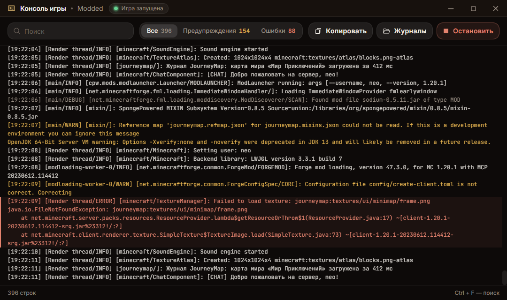

import { Aside } from "@astrojs/starlight/components";

Консоль показывает всё, что игра пишет в свой журнал, в отдельном окне лаунчера и сразу, по мере того как строки появляются. Окно растягивается, разворачивается на весь экран и встаёт рядом с игрой. После выхода из игры, в том числе после падения, журнал остаётся в окне до следующего запуска.

## Как открыть

- Кнопка «Консоль» на плашке запущенной игры.
- Кнопка «Весь журнал» в окне, которое появляется после падения игры.
- Сама при каждом запуске, если в настройках лаунчера включён переключатель «Консоль игры». По умолчанию он выключен.

Переключатель принадлежит игроку, отдельного ключа в конфиге сервера для него нет. Скрывать журнал бессмысленно: тот же текст лежит у игрока в `logs/latest.log`.

## Что умеет окно

- Поиск (`Ctrl + F`, на macOS `⌘ F`) оставляет строки с запросом и подсвечивает совпадения. `Esc` очищает поле.
- Фильтр «Все», «Предупреждения» и «Ошибки». «Предупреждения» показывает и предупреждения, и ошибки. Рядом с каждым пунктом стоит число строк.
- «Копировать» кладёт в буфер обмена то, что сейчас видно, с учётом поиска и фильтра.
- «Журналы» открывает папку `logs` сборки с `latest.log` и `debug.log`. Отчёты о падениях Minecraft кладёт рядом, в `crash-reports`.
- «Остановить» завершает игру, как одноимённая кнопка в главном окне.

Ошибки выделены красным, предупреждения жёлтым, отладочные строки приглушены. Уровень лаунчер читает из самой строки: `[main/WARN]`, `[Render thread/ERROR]`, `[SEVERE]`. Строка без уровня получает уровень предыдущей, поэтому стек вызовов под ошибкой тоже красный. Вывод в stderr без уровня считается предупреждением.

Пока окно прокручено в самый низ, новые строки подтягиваются сами. Если прокрутить вверх, журнал замирает на месте, а внизу появляется счётчик новых строк. Нажатие на него возвращает к последним.

## Сколько строк хранится

Лаунчер держит последние 50 000 строк текущего запуска. Если журнал длиннее, самые ранние строки уходят, и внизу окна написано, сколько их было. Полная версия остаётся в `logs/latest.log`. Новый запуск игры начинает журнал заново.

Кириллица не ломается ни на одной системе. Строки в кодировке Windows (cp1251 и другие) лаунчер узнаёт и переводит сам, а цветовые коды терминала и Minecraft (`§a`, `§l`) вырезает.

<Aside>
  Отчёт, который игрок отправляет кнопкой «Отправить разработчикам», берётся из этого же журнала:
  последние 256 КБ. Куда он приходит, описано в [отчётах о падениях](/launcher/crashes).
</Aside>
